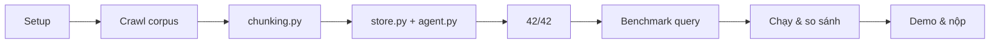

# Hướng dẫn Giảng viên/Trợ giảng — Lab 07 K4-L3A (Nền tảng Dữ liệu: Embedding & Vector Store)

Run-sheet cho buổi lab 4 giờ, dùng song song với [`../day7-lab-data-foundations.md`](../day7-lab-data-foundations.md) (bản học viên đọc) và [`../K4_VARIANT.md`](../K4_VARIANT.md) (ràng buộc chủ đề). Mốc thời gian dưới đây **tính tương đối từ lúc lớp bắt đầu** (0:00) — lớp bắt đầu lúc nào thì cộng dồn từ đó, không phải giờ tuyệt đối.

> Chuẩn môi trường: Python **3.11.x**. Phần lõi (core) chỉ cần `requirements.txt` (`pytest` + `python-dotenv`); không yêu cầu PyTorch, API key hay GPU để hoàn thành 60 điểm code.

---

## 0. Hình thức: nhóm nhưng chấm cá nhân riêng

Lớp ngồi theo nhóm 3–4 người, nhưng điểm tách bạch:

| | Ai làm | Điểm | Nộp ở đâu |
| --- | --- | --- | --- |
| Phần cá nhân | Mỗi người tự code toàn bộ `src/`, không chia bài | **60đ** | `report/REPORT_CANHAN.md` (1 file/người) |
| Phần nhóm | Chung 1 chủ đề dữ liệu + 1 bộ 5 câu hỏi, mỗi người tự thử 1 chiến lược riêng rồi so sánh | **40đ** | `report/REPORT_NHOM.md` (1 file/nhóm) |

**Nói rõ ngay đầu giờ**: "nhóm" ở đây không có nghĩa chia việc code cho nhau — ai cũng phải tự hoàn thiện `src/` và tự chạy benchmark của mình. Nhóm chỉ dùng chung dữ liệu + câu hỏi để có cơ sở so sánh chiến lược.

Chủ đề bắt buộc của **L3A**: dịch vụ/quy định đại học (đăng ký học phần, học phí, học bổng, thư viện, ký túc xá, phúc khảo). Metadata bắt buộc: `audience` (`student`/`faculty`/`staff`/`all`). Lớp song song L3B crawl chủ đề thương mại điện tử (`audience`: `buyer`/`seller`/`both`) — không liên quan tới lớp này, chỉ nêu để tránh nhầm khi so tài liệu giữa 2 lớp.

Nhóm 3 người có 3 vai cố định (vai chỉ là trách nhiệm điều phối thêm, không miễn code):

| Vai | Việc | Hạn |
| --- | --- | --- |
| R1 · Data | Chốt chủ đề, chia mỗi người 2–3 URL, kiểm metadata từng file, giữ `sources.csv` | CP2 |
| R2 · Benchmark | Viết 5 query + gold answer, tự kiểm mỗi gold answer trích được từ tài liệu thật | CP5 |
| R3 · Strategy | Bảo đảm không ai trùng chiến lược, nhận vai chunk theo heading, chạy baseline cho nhóm | CP5 |

Nhóm 4 người: người thứ 4 làm Report & Demo Lead (gom kết quả, dẫn thuyết trình).

---

## 1. Toàn cảnh timeline

| Giai đoạn | Thời gian | Nội dung | Checkpoint |
| --- | --- | --- | --- |
| 1. Dữ liệu | 0:00–1:00 | Setup, chia vai, crawl corpus | CP1 @0:20 · CP2 @1:00 |
| 2. Code cá nhân | 1:00–2:30 | Warm-up + hoàn thiện `src/` | CP3 @1:45 · CP4 @2:30 |
| 3. Chiến lược | 2:30–3:00 | 5 benchmark query + chiến lược riêng | CP5 @3:00 |
| 4. So sánh | 3:00–3:25 | Chạy benchmark, so sánh, phân tích lỗi | CP6 @3:25 |
| 5. Demo & nộp | 3:25–4:00 | Thuyết trình, hoàn thiện báo cáo, push | CP7 @4:00 |



---

## 2. Chi tiết từng checkpoint

### CP1 — 0:20 · Setup xong

- **Lệnh kiểm tra**: `pytest tests/ -v`
- **Đạt khi**: đúng **31 failed, 11 passed** trên 42 test (không phải 0 passed — code còn TODO; 11 pass là test cấu trúc project + `FixedSizeChunker` có sẵn).
- **Bẫy hay gặp**: `ModuleNotFoundError` → venv chưa activate hoặc chưa `pip install -r requirements.txt`.
- **Ngưỡng can thiệp**: quá 0:25 mà học viên chưa ra đúng baseline này thì phải hỗ trợ ngay — mọi bước sau phụ thuộc bước này.

### CP2 — 1:00 · Đủ dữ liệu, đúng metadata

- **Cách kiểm tra**: script Python có sẵn trong mục CHECKPOINT 2 của lab doc — tự đọc frontmatter mọi file `.md` trong `data/<chủ-đề>/`, in `OK`/`THIEU METADATA` từng dòng, đối chiếu `sources.csv`.
- **Đạt khi**: **5–10 file**, mỗi file đủ 6 field bắt buộc (`doc_id`, `title`, `source_url`, `retrieved_at`, `document_version`, `audience`), `sources.csv` khớp 1-1, và **`audience` có ≥2 giá trị khác nhau** (student/faculty/staff/all). Chỉ 1 giá trị = coi như fail, vì benchmark ở Giai đoạn 3 sẽ không chứng minh được gì.
- **Bẫy hay gặp**:
  - Crawl trúng trang bị `robots.txt` cấm → script báo `disallowed by robots.txt`. Đây **không phải lỗi cần vượt qua** — dạy học viên đổi nguồn, không tìm cách bypass.
  - Trang render bằng JavaScript → `extracted content is too short`. Đổi nguồn.
  - Script crash cả lượt với `LookupError: unknown encoding: ...` khi server trả charset lạ (`charset=utf-8,gbk`) — bug đã biết, không nằm trong danh sách bắt lỗi của script. Bỏ URL đó khỏi CSV, chạy tiếp.
  - Output thô còn dính menu/tin tức chưa làm sạch → chunk sẽ bị nhiễu ở Giai đoạn 4.
  - Gộp 2 đối tượng khác nhau (`student` + `faculty`) vào 1 file → filter vô dụng dù metadata "đẹp trên giấy". Phải tách file.
- **Nếu trễ giờ**: ưu tiên đủ 5 file chất lượng hơn cố lấy 10 file ẩu — rubric chấm chất lượng & minh bạch nguồn, không chấm số lượng.
- Nhắc học viên điền luôn Data Inventory + Metadata Schema vào `REPORT_NHOM.md` mục 1 ngay tại đây, đừng dồn về cuối.

### CP3 — 1:45 · Xong phần chunking

- **Lệnh kiểm tra**: `pytest tests/ -k "Chunker or Similarity or Compare" -v`
- **Đạt khi**: **23 passed** — 7 test có sẵn (`TestFixedSizeChunker`) + 16 test phần vừa code (`TestSentenceChunker`, `TestRecursiveChunker`, `TestComputeSimilarity`, `TestCompareChunkingStrategies`).
- **Sai lầm phổ biến**:
  - `SentenceChunker`: split bằng `[.!?]\s+` làm mất dấu câu, mọi chunk thành câu cụt — phải tách ở vị trí *sau* dấu câu mà vẫn giữ được nó.
  - `RecursiveChunker`: chỉ viết một chiều (đệ quy xuống sâu) mà quên chiều "gom lên" (nối các mảnh nhỏ liền kề) → sinh hàng trăm chunk vụn 5–10 ký tự.
  - `RecursiveChunker`: thiếu base case khi `separators=[]` → fail `test_empty_separators_falls_back_gracefully`.
  - `compute_similarity`: quên xử lý vector độ dài 0 → `ZeroDivisionError` thay vì trả `0.0`.
  - `ChunkingStrategyComparator.compare`: gõ sai tên key (`fixed_size`/`by_sentences`/`recursive`) → `KeyError`.
- **Nếu trễ giờ**: ưu tiên `SentenceChunker` (comparator cần nó) + `compute_similarity` (ngắn), để `RecursiveChunker` lại sau — `EmbeddingStore` ở bước tiếp mới là phần nhiều test nhất.

### CP4 — 2:30 · MỐC QUAN TRỌNG NHẤT

- **Lệnh kiểm tra**: `pytest tests/ -v` (phải **42 passed**) + `python main.py "Chunking là gì?"` chạy trọn vẹn không lỗi (dòng `Skipping missing file: data/customer_support_playbook.txt` là bình thường).
- Đây là mốc nặng nhất: `EmbeddingStore` (5 method — `_make_record`, `_search_records`, `add_documents`, `search`, `get_collection_size`, `search_with_filter`, `delete_document` — 14 test) + `KnowledgeBaseAgent.answer` (dựng context có citation `[1][2][3]`, chống bịa khi context rỗng).
- **Sai lầm phổ biến**:
  - Không xoá nhánh ChromaDB (`self._use_chroma = True` gán trước khi khởi tạo client) → nếu máy tình cờ có `chromadb` cài sẵn, cả 14 test sập. Dạy học viên bỏ hẳn nhánh Chroma, chỉ dùng in-memory.
  - `search` và `search_with_filter` viết hai đường code khác nhau → `test_no_filter_returns_all_candidates` fail. Phải cho cả hai gọi chung `_search_records`.
  - `search_with_filter` lọc **sau** khi search thay vì **trước** → có thể trả về 0 kết quả dù store vẫn còn tài liệu hợp lệ (k slot bị tài liệu sai chiếm hết).
  - `delete_document` luôn trả `False` vì record thiếu `metadata['doc_id']` — phải set trong `_make_record`.
  - `KnowledgeBaseAgent.answer` không inject context vào prompt, hoặc không xử lý store rỗng (phải trả thông báo, không crash, không gọi LLM vô ích).
- Học viên chụp output `pytest tests/ -v` dán vào `REPORT_CANHAN.md` mục 3 (30 điểm) ngay tại đây.
- **Nếu ai chưa xong 42/42**: vẫn cho qua Giai đoạn 3 cùng nhóm, fix song song, nhưng không được trễ quá 3:00 (CP5 cần `src/` chạy được).

### CP5 — 3:00 · Có bộ câu hỏi + mỗi người 1 chiến lược

- **Không chấm bằng test** — chấm bằng việc `python bench.py` chạy ra top-3 cho cả 5 câu hỏi.
- **Đạt khi**: 5 câu hỏi + gold answer đã chốt (ít nhất 1 câu **cần** `metadata_filter={"audience": "student"}` mới trả lời đúng), và mỗi thành viên đã đổi sang **chunker khác nhau** — không ai trùng (gợi ý: 1 người `FixedSizeChunker` có overlap, 1 người `RecursiveChunker`, 1 người chunk theo heading — vai R3 chunk-theo-heading là bắt buộc phải có ít nhất 1 người).
- **Sai lầm phổ biến trong `bench.py`**:
  - Nạp cả file làm 1 `Document` (như `main.py`) thay vì chunk trước → retrieval trả về nguyên file, vô dụng.
  - `doc_id` trong metadata phải trỏ về **tên file gốc**, còn `Document.id` mới là `"file#0"`, `"file#1"`.
  - Metadata frontmatter không được trải vào mọi chunk → `search_with_filter` không có gì để lọc.
  - Đổi nhiều hơn 1 dòng khi chuyển chiến lược → so sánh không còn công bằng giữa các thành viên.
- Chưa cần quan tâm kết quả tốt/xấu ở bước này — CP6 mới xét chất lượng.

### CP6 — 3:25 · Đã so sánh và tìm ra lỗi thật

- Mỗi người có `ket_qua_benchmark.txt` riêng, đã điền bảng top-3 vào `REPORT_CANHAN.md` mục 5.
- **Điểm dạy quan trọng nhất buổi — chấm 2 mức, không chỉ 1**: cách chấm ngây thơ là kiểm `doc_id` của tài liệu gold có nằm trong top-3 không → **thổi phồng kết quả**. Một chiến lược (đặc biệt chunker theo heading) có thể lấy trọn cả 3 slot top-3 từ đúng tài liệu gold mà **không chunk nào chứa câu trả lời** — vì các section trong cùng tài liệu nói cùng chủ đề nên điểm gần bằng nhau, section nào lọt top-3 gần như ngẫu nhiên. Phải kiểm ở mức nội dung: có chuỗi đặc trưng chứa đáp án trong ngữ cảnh truy xuất được không.
- Thang điểm tham khảo: 2đ nếu gold ở top-1 và ngữ cảnh chứa đáp án, 1đ nếu gold ở top-2/3, 0đ nếu vắng hoặc ngữ cảnh không trả lời được.
- **A/B bắt buộc**: chạy câu cần filter 2 lần (có/không `metadata_filter`) trên cả 3 chiến lược. Nếu kết quả giống hệt nhau → câu hỏi chưa thực sự cần filter, phải quay lại sửa.
- Nhóm phải có ít nhất 1 failure case thật: câu nào hỏng, vì sao, đề xuất sửa — điền vào `REPORT_NHOM.md` mục 2 và 4.

### CP7 — 4:00 · Nộp bài

Checklist xác nhận với học viên trước khi rời phòng:

- [ ] `pytest tests/ -v` → 42 passed
- [ ] `src/` không còn `raise NotImplementedError`
- [ ] `data/<chủ-đề>/` có 5–10 tài liệu đủ metadata + `sources.csv` khớp 1-1
- [ ] Có ít nhất 1 query dùng `metadata_filter={"audience": "student"}`
- [ ] Ít nhất 1 thành viên chunk theo heading/section
- [ ] Hai báo cáo điền đủ, output pytest là thật (không phải ảnh chụp giả)
- [ ] `bench.py` + `ket_qua_benchmark.txt` đã commit
- [ ] Repo đúng tên quy ước `DAY07-MSSV-HoVaTen`, **không** chứa `.venv/` hay `.env`
- [ ] Đã nộp link repo vào vlearn

---

## 3. Phần Demo (6–8 phút/nhóm)

Cấu trúc:

1. Chủ đề + bộ tài liệu (1 phút)
2. Mỗi thành viên tóm tắt chiến lược mình chọn (2 phút)
3. So sánh + giải thích chiến lược nào thắng, vì sao (3 phút)
4. Demo trực tiếp 1–2 câu hỏi qua `bench.py` (2 phút)
5. Hỏi đáp

Yêu cầu: mở sẵn terminal đã chạy được **trước khi** demo — debug trực tiếp trên sân khấu bị trừ điểm. Nhóm chưa tới lượt tranh thủ hoàn thiện báo cáo.

**3 câu hỏi Q&A gợi ý** (dùng nhất quán cho mọi nhóm để so sánh công bằng):

1. "Đổi sang chủ đề khác thì chiến lược của bạn còn dùng được không?" — kiểm tra học viên hiểu chunk theo heading là đặc thù văn bản có cấu trúc, không phải lúc nào cũng tốt nhất.
2. "Metadata filter giúp ở đâu và làm mất kết quả ở đâu?" — kiểm tra học viên hiểu trade-off precision/recall, không chỉ nói filter luôn tốt.
3. "Nhóm học được gì từ nhóm khác?" — khuyến khích nghe nhóm bạn thay vì chỉ chờ tới lượt mình.

Có thể đào sâu thêm bằng cách hỏi thẳng vào failure case họ ghi trong báo cáo, xem có phải tự tìm ra hay chỉ chép mẫu.

**Đúc kết cuối buổi**: "Cùng tài liệu, nhưng chiến lược khác nhau → kết quả rất khác nhau. Chấm 2 mức (doc_id đúng vs. nội dung có đáp án) quan trọng hơn chấm 1 mức. Chất lượng dữ liệu thường quan trọng hơn đổi sang mô hình đắt tiền hơn."

---

## 4. Embedder thật là tùy chọn, không phải điều kiện

- Lab **không bắt buộc** cài embedder thật — mặc định dùng `_mock_embed`, học viên vẫn pass 42 test và hoàn thành 60 điểm code mà không cần tải mô hình nào.
- Nếu học viên muốn số liệu benchmark thật (không nhiễu như mock) ở Giai đoạn 3–4, `src` hỗ trợ 3 lựa chọn:
  - **Local** (`sentence-transformers/paraphrase-multilingual-MiniLM-L12-v2`, miễn phí, không cần key, phù hợp corpus tiếng Việt): `pip install -r requirements-local.txt`
  - **OpenAI**: `pip install openai` + `OPENAI_API_KEY`
  - **Gemini** — khuyến nghị cho học viên không có OpenAI key, vì API key lấy miễn phí tại aistudio.google.com, không cần thẻ thanh toán: `pip install google-genai` + `GEMINI_API_KEY`

Ví dụ nhanh (đổi `LocalEmbedder`/`OpenAIEmbedder`/`GeminiEmbedder` tuỳ backend):

```bash
python3 - <<'PY'
from src import GeminiEmbedder
embedder = GeminiEmbedder()
print(embedder._backend_name, len(embedder("embedding smoke test")))
PY
```

- Nói rõ ngay từ đầu: "Local/OpenAI/Gemini embedder là điểm cộng, không phải điều kiện để hoàn thành lab."
- Học viên máy yếu/mạng chậm/không key → cứ tiếp tục `_mock_embed`, đừng để bị kẹt ở setup.
- `MockEmbedder` băm MD5 nên **không mã hoá ngữ nghĩa** — nếu buộc phải dùng mock, học viên phải ghi rõ trong báo cáo rằng số liệu bị chi phối bởi mock, và chuyển trọng tâm phân tích sang `count`/`avg_length`/độ mạch lạc chunk (không phụ thuộc embedding).

**Bài giải tham khảo (reference solution)**: dành cho giảng viên/maintainer, không phân phối cho học viên. Nếu muốn đặt đáp án ngay trong repo này để tiện so sánh khi chấm, để vào thư mục `src_w_solution/` (đã có sẵn trong `.gitignore`, không bị commit nhầm).

---

## 5. Bảng lỗi thường gặp (tổng hợp nhanh khi đi vòng quanh lớp)

| Triệu chứng | Nguyên nhân | Cách sửa |
| --- | --- | --- |
| `ModuleNotFoundError: No module named 'src'` | Chạy python từ thư mục khác | `cd` về thư mục gốc repo |
| Test store fail dù code trông đúng | `_use_chroma = True` nhưng nhánh Chroma chưa cài đặt | Set `False`, chỉ dùng in-memory |
| `test_no_filter_returns_all_candidates` fail | `search` và `search_with_filter` dùng hai đường code khác nhau | Cho cả hai gọi chung `_search_records` |
| `delete_document` luôn trả `False` | Record không có `metadata['doc_id']` | Set `doc_id` trong `_make_record` |
| `test_empty_separators_falls_back_gracefully` fail | Thiếu base case cho `separators == []` | Thêm nhánh cắt cứng theo `chunk_size` |
| `ZeroDivisionError` trong `compare` | Chia cho `count == 0` khi text rỗng | Chặn trước khi chia |
| Chunk vụn 5–10 ký tự | `RecursiveChunker` thiếu bước gom | Nối các mảnh nhỏ liền kề tới sát `chunk_size` |
| `KeyError` khi đọc kết quả comparator | Tên key gõ sai | So từng ký tự với docstring |
| Crawler báo `disallowed by robots.txt` | Nguồn không cho truy cập tự động | Đổi nguồn — không phải lỗi cần vượt qua |
| Crawler crash `LookupError: unknown encoding` | Server trả charset không hợp lệ | Bỏ URL đó khỏi CSV, xử lý riêng |
| `search_with_filter` luôn trả rỗng | Metadata không được trải vào từng chunk | Gộp frontmatter vào metadata khi tạo `Document` |
| Filter không đổi kết quả gì | Corpus chỉ có một giá trị `audience`, hoặc hai đáp án nằm chung một file | Tách file theo `audience` |
| Score âm cho chunk đúng | Đang dùng `MockEmbedder` | Bật embedder thật (mục 4) |
| Tất cả thành viên chọn cùng một chiến lược | Không phân công rõ ở CP2 | Yêu cầu mỗi người thử chiến lược khác nhau — mục tiêu là để so sánh |
| 5 câu hỏi benchmark quá dễ/giống nhau | Chưa đa dạng dạng hỏi | Yêu cầu: tra số liệu, hỏi điều kiện, hỏi quy trình, liệt kê |

---

## 6. Tiêu chí buổi lab thành công

- Mọi học viên đạt baseline đúng ở CP1 trước 0:25, không ai bị kẹt ở setup.
- Đa số học viên đạt 42/42 ở CP4 (mốc quan trọng nhất) trước 2:30, số còn lại fix xong trước 3:00.
- Mỗi nhóm có ≥2 chiến lược chunking khác nhau để so sánh thật (không ai trùng).
- Học viên giải thích được **tại sao** chiến lược A tốt hơn B trên dữ liệu cụ thể, phân biệt được "top-3 đúng doc_id" và "top-3 có nội dung trả lời được".
- Mỗi nhóm nộp được ít nhất 1 failure case thật trong `REPORT_NHOM.md`.
- Phần thảo luận cuối buổi có sự so sánh sôi nổi giữa các nhóm, không chỉ đọc báo cáo.
